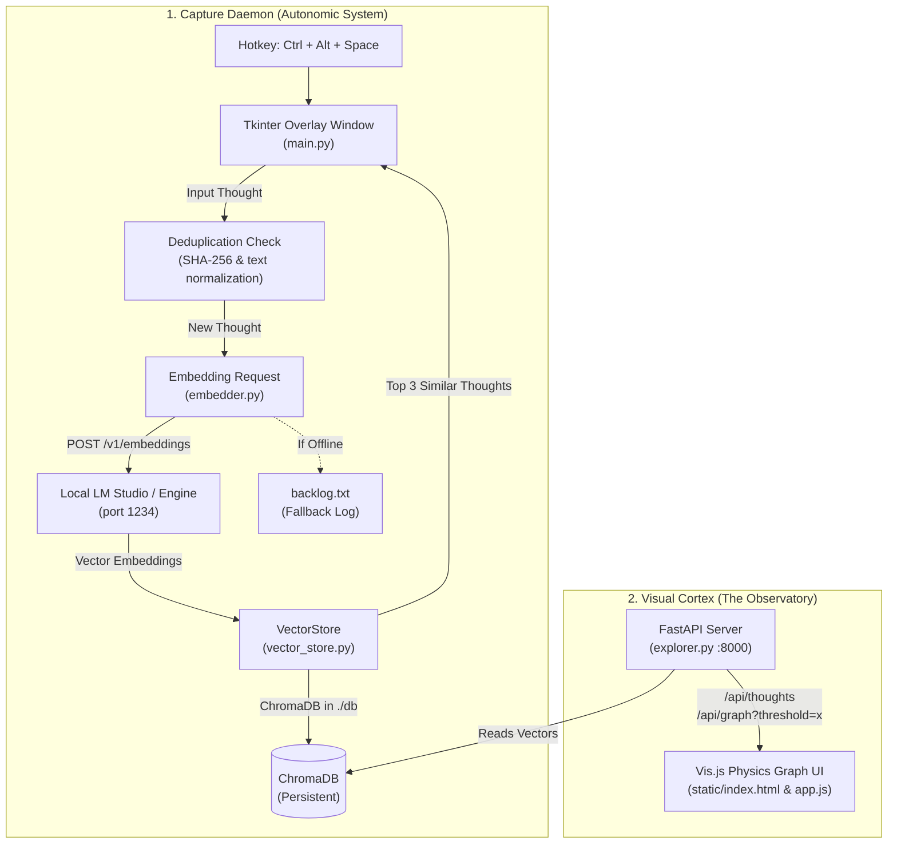

# Local Subconscious

> *Stop organizing your mind. Let the physics of the latent space do it for you.*

We have been conditioned by decades of legacy computing to treat our machines like filing cabinets. We cram our thoughts into rigid folders, tag them with brittle keywords, and force our fractal, non-linear consciousness to adapt to the limitations of a hierarchical filesystem. Worse, we rent space on centralized corporate servers to do it, handing over the most intimate, chaotic fragments of our psyche to cloud telemetry.

**Local Subconscious** is a rejection of that paradigm. 

It is a completely sovereign, localized cognitive prosthetic designed to run natively on your hardware (optimized for high-efficiency ARM/Snapdragon or any modern local compute). It does not search; it *associates*. It is built on the premise that the human mind thrives on chaos, and that semantic vector spaces are the only architecture fluid enough to actually mirror how we think.

## The Architecture of the Mind



This project is split into two decoupled hemispheres:

### 1. The Autonomic System (Capture & Embed)
A lightweight, always-on Python daemon (`main.py`) running in the background. 
* **Zero Friction:** Bound to a global hotkey (`Ctrl + Alt + Space`). A borderless, minimalist black box summons instantly over any application you are running.
* **Total Chaos:** You type a raw, unfiltered thought—a code snippet, a philosophical realization, a dream, a frustration—and hit enter. The box vanishes.
* **Local Processing:** The text is instantly pinged to a local instance of [LM Studio](https://lmstudio.ai/) running a lightweight embedding model (like `nomic-embed-text` or `all-MiniLM`).
* **Semantic Gravity:** The thought is translated into high-dimensional geometric coordinates and written to a completely local `ChromaDB` instance on your drive. *No API keys. No cloud. Absolute privacy.*
* **Reflection State:** The daemon queries the 3 most conceptually resonant past thoughts *before* committing the new thought to memory, immediately presenting associations.

### 2. The Visual Cortex (The Observatory)
A FastAPI web server (`explorer.py`) pushing data to a physics-based frontend (`Vis.js`).
* **Gravitational Mapping:** Standard UIs are linear. This UI is topological. It maps your thoughts as nodes in a floating, interactive nebula.
* **Semantic Resonance:** Using the Barnes-Hut algorithm, thoughts that share underlying conceptual meaning physically pull toward each other on the screen. An observation about "analog audio" will structurally bond to a thought about "driving a manual sports car" because the neural weights recognize the aesthetic resonance.
* **The Threshold Dial:** A live slider lets you adjust the strictness of the cosine similarity. Slide it down, and watch the invisible, fringe connections form across completely different eras of your life.

---

## Core Components & Structure

* **`main.py`**: Background capture daemon and borderless Tkinter HUD. Listens for `Ctrl + Alt + Space`, handles non-blocking async embedding calls, deduplication, and reflection playback.
* **`vector_store.py`**: ChromaDB persistent interface (`./db/`). Manages vector operations, SHA-256 content deduplication, and thread-safe collection queries.
* **`embedder.py`**: Local HTTP client targeting OpenAI-compatible embedding endpoints (e.g., LM Studio at `http://localhost:1234/v1/embeddings`) with graceful offline fallback to `backlog.txt`.
* **`explorer.py`**: FastAPI backend exposing `/api/thoughts` and `/api/graph`, dynamically generating cosine-similarity edge matrices for the frontend.
* **`static/` (`index.html`, `app.js`, `styles.css`)**: Dark-mode interactive Vis.js visualization engine featuring real-time similarity filtering, node search, and thought inspection.
* **`start_local_subconscious.ps1`**: Windows launch script managing process startup, port cleanup, and log redirection (`logs/`).
* **`test_core.py`**: Test suite covering deduplication edge cases, legacy metadata handling, and ChromaDB error resilience.

---

## Ignition Sequence

1. **Spin up the Neural Engine:** Open LM Studio. Load a lightweight embedding model (e.g., `nomic-embed-text-v1.5.Q4_K_M.gguf`). Ensure the local server is running on port `1234`.
2. **Clone the Matrix:** 
   ```bash
   git clone git@github.com:snakewizardd/local-subconscious.git
   cd local-subconscious
   pip install -r requirements.txt
   ```
3. **Start the Autonomic Daemon:**
   ```bash
   python main.py
   ```
   *(Note: The global hotkey `Ctrl + Alt + Space` is now active).*
4. **Launch the Visual Cortex:**
   ```bash
   python explorer.py
   ```
   Open your browser to `http://localhost:8000` to explore your mapped thoughts.
   
*(Alternative on Windows: Run `./start_local_subconscious.ps1` to launch both services simultaneously).*